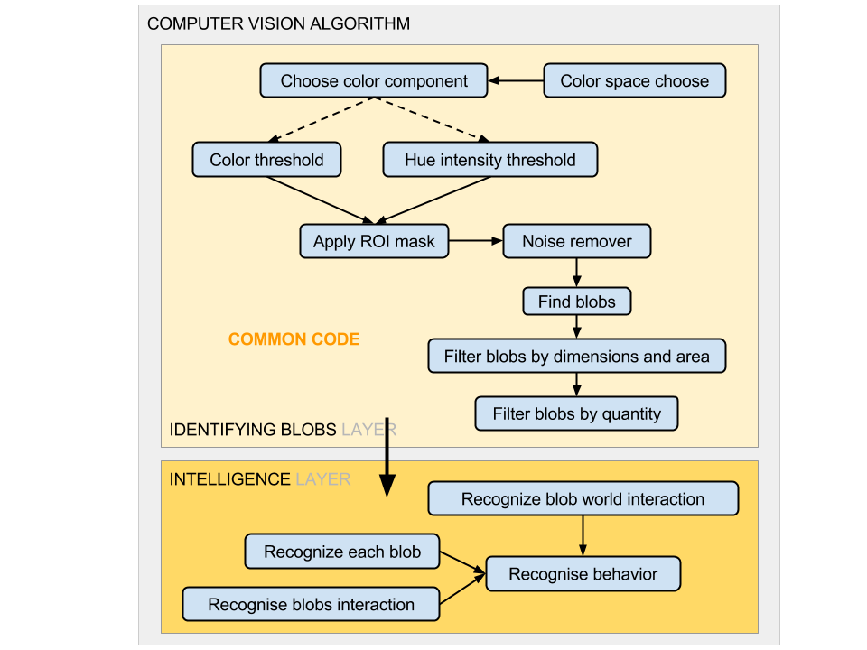
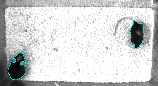
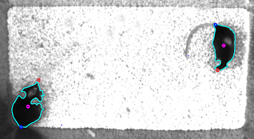

.. Modular Computer Vision library documentation master file, created by
   sphinx-quickstart on Mon Mar 13 14:28:11 2017.
   You can adapt this file completely to your liking, but it should at least
   contain the root `toctree` directive.

Modular Computer Vision library
===========================================================

The library implement simple computer vision filters that can be attached or detached according to the image conditions without screwing the CV algorithm.

It follows the next principle:

The filters that pass the information information for the algorithm are in an independent layer, so they can be replaced without significant changes in the code.

How it works:
___________________

.. code-block:: python
	:linenos:

	#Import all filter classes
	from OTPAdaptativeThreshold import OTPAdaptativeThreshold
	from OTPBlur import OTPBlur
	from OTPMaskImage import OTPMaskImage
	from OTPFindBlobs import OTPFindBlobs
	from OTPSelectBiggerBlobs import OTPSelectBiggerBlobs

	class OTPModuleGroup(OTPSelectBiggerBlobs,OTPFindBlobs,OTPMaskImage,OTPBlur,OTPAdaptativeThreshold):
		"""Group all classes responsibles for the filters"""

		def __init__(self, **kwargs):
			"""Init all parents classes"""
			super(OTPModuleGroup, self).__init__(**kwargs)
			#CLASS PARAMETERS ...#

	if __name__ == "__main__": #Check if the file is being executed directly
		import cv2
		capture = cv2.VideoCapture("videofilename.avi") #Open the video file
		module = OTPModuleGroup() #Init the class that implement all the filters

		while True:
			res, frame = capture.read() #read frame
			if not res: break;

			blobs = module.process(frame) #Apply the filters to the image and return the blobs
			for b in blobs: b.draw(frame) #Draw the blobs contours

			cv2.imshow("Capture", frame) #Show the image
			key = cv2.waitKey(1) #Wait for a key
			if key == ord('q'): break

Now we will change the code to detect the rats head and tail positions.
...

.. code-block:: python
	:linenos:
	
	class OTPModuleGroup(OTPBlobExtremePoints, OTPSelectBiggerBlobs, OTPFindBlobs, OTPMaskImage, OTPBlur, OTPAdaptativeThreshold):

...
Just by making OTPModuleGroup inheriting from OTPBlobExtremePoints we will have this result:

With the addition of only one word we were able to add a new functionality to our code... 

.. toctree::
   :hidden:
   :maxdepth: 2
   :includehidden:
   :caption: Getting started

   Introduction <self>
   mcvbase